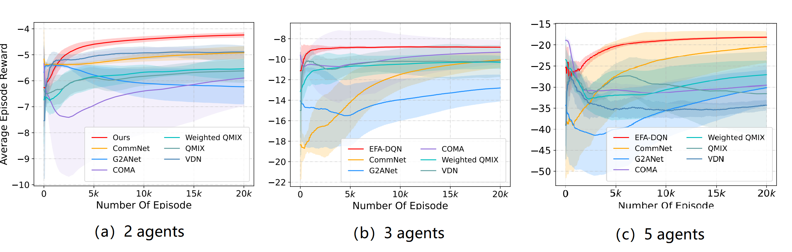
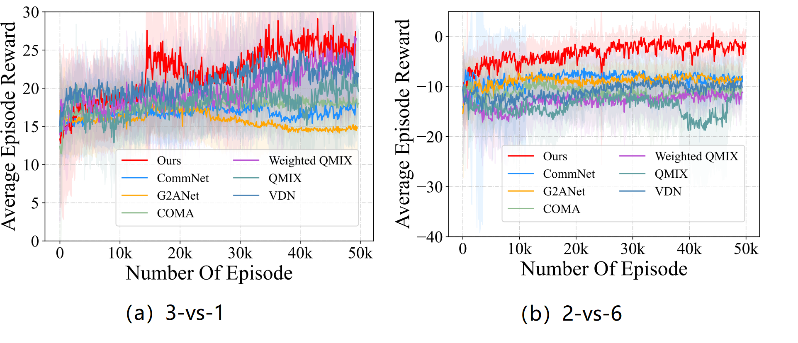
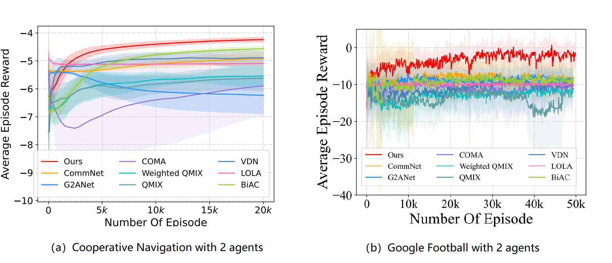
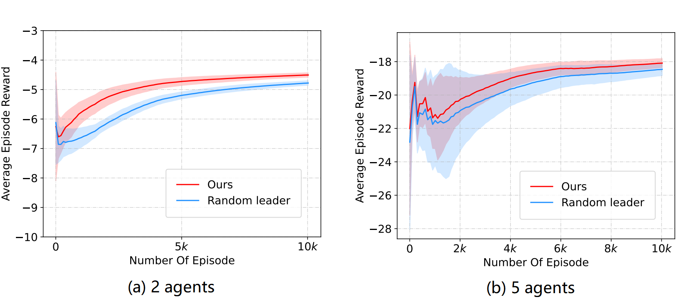

# Learning Multi-agent Action Coordination via Electing First-move Agent

## 1. Environments supported:

- [Multiagent Particle-World Environments (MPEs)](https://github.com/openai/multiagent-particle-envs)
- [Google Research Football](https://github.com/google-research/football)

## 2.  Installation

### 2.1  create conda environment

``` Bash
conda create -n marl python==3.6.1
conda activate marl
pip install torch==1.5.1+cu101 torchvision==0.6.1+cu101 -f https://download.pytorch.org/whl/torch_stable.html

```

### 2.2 create football environment

- Please refer to [Google Research Football](https://github.com/google-research/football)

## 3. Training

1. we use training  Cooperative Navigation as an example:

```
cd CooperativeNavigation
python train.py
```

2. we use training Google Football as an example:

```
# 3vs1 scenario
cd GoogleFootball/3vs1
python train.py

# 2vs6 scenario
cd GoogleFootball/2vs6
python train.py
```

## 4. Empirical Results

- [**Section 4.1: The comparison with VDN, QMIX, Weighted QMIX, COMA, CommNet and G2ANet on Cooperative Navigation.**](#41-The-final-results-on-cooperative-navigation)
- [**Section 4.2: The comparison with VDN, QMIX, Weighted QMIX, COMA, CommNet and G2ANet on Google Football.**](#42-the-final-results-on-google-football)
- [**Section 4.3: The comparison LOLA (2 agents).**](#43-the-comparison-with-lola)
- [**Section 4.4: The comparison with BiAC (2 agents).**](#44-the-comparison-with-biac)
- [**Section 4.5: The  importance of optimally electing the leader**](#45-the-importance-of-optimally-electing-the-leader)

### 4.1. The final results on Cooperative Navigation 




### 4.2. The final results on Google Football





### 4.3. The comparison with LOLA

Tips: 
- Our reproduce for LOLA is available at this repo :  [AC_LOLA](https://github.com/Anonymous-accounts/EFA-DWM/tree/master/AC_LOLA)
- LOLA has an elegant theory guarantee of 2 agents in a general-sum game but no such guarantee with more than 2 agents. Due to the limitation of LOLA, we only test the LOLA with 2 agents. 
- In the future, we can investigate the gradient effects (average gradients from other agents or gradient effects between pairs) of multiple agents (more than 2).



### 4.4. The comparison with BiAC
- **2 agents on the Cooperative Navigation and Google Football**


### 4.5. The  importance of optimally electing the leader

- **The emperical results about 2 agents and 5 agents on the Cooperative Navigation**




